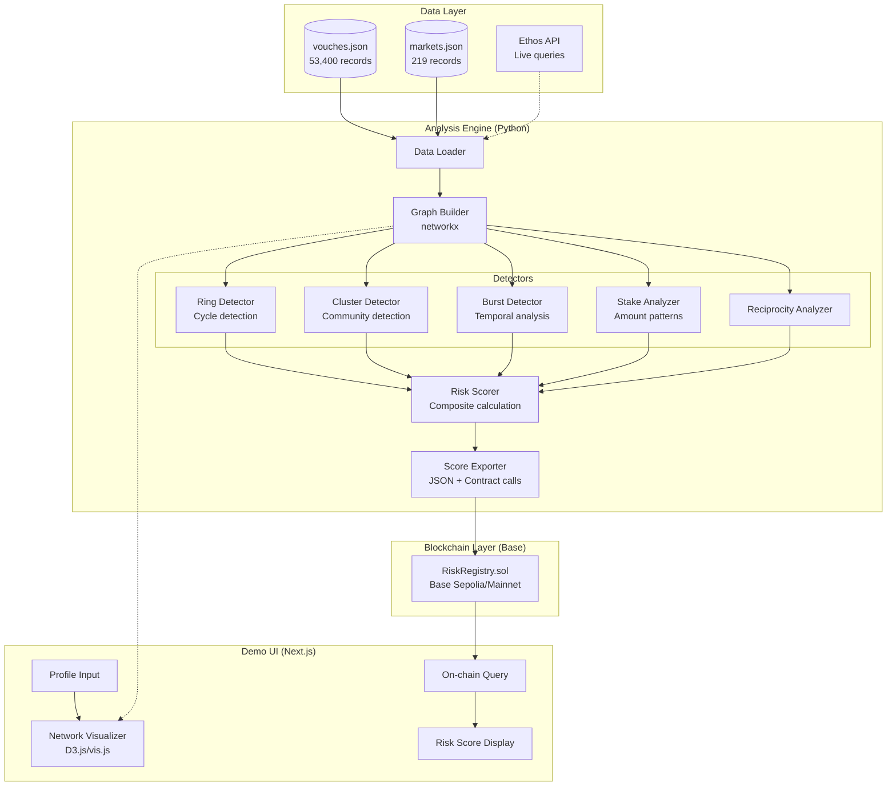
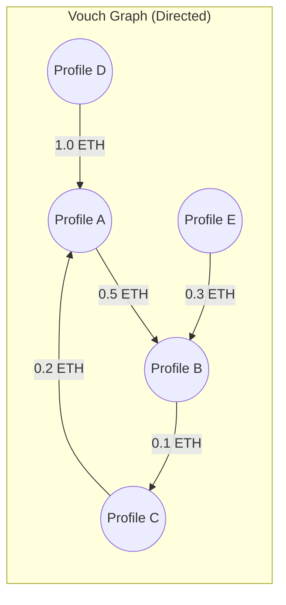
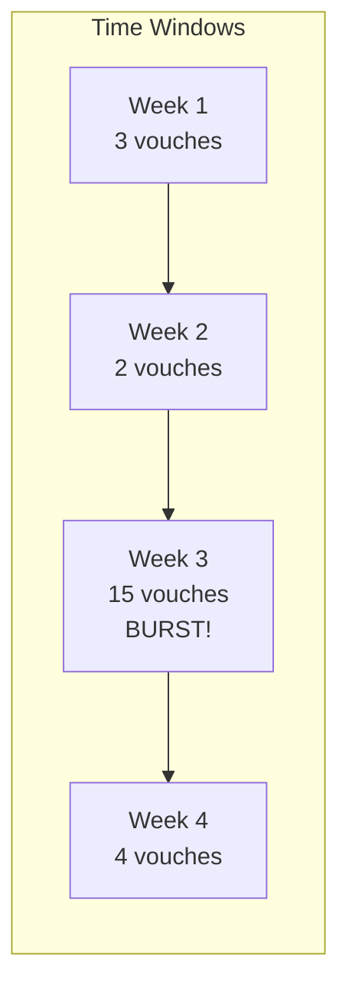
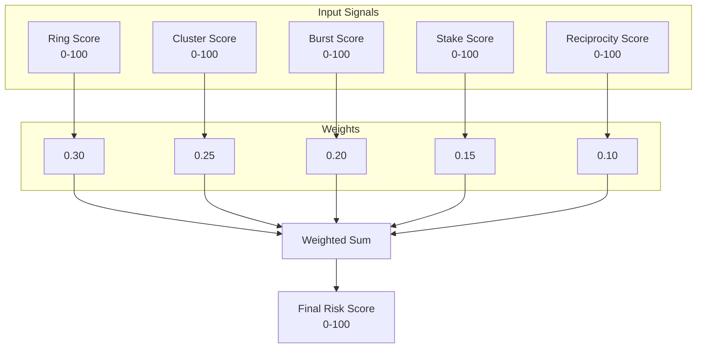
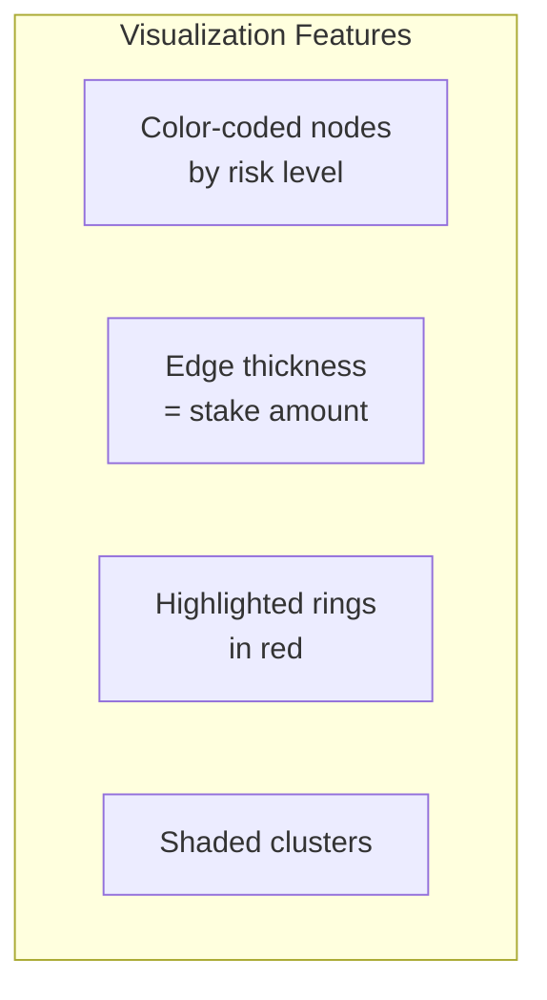
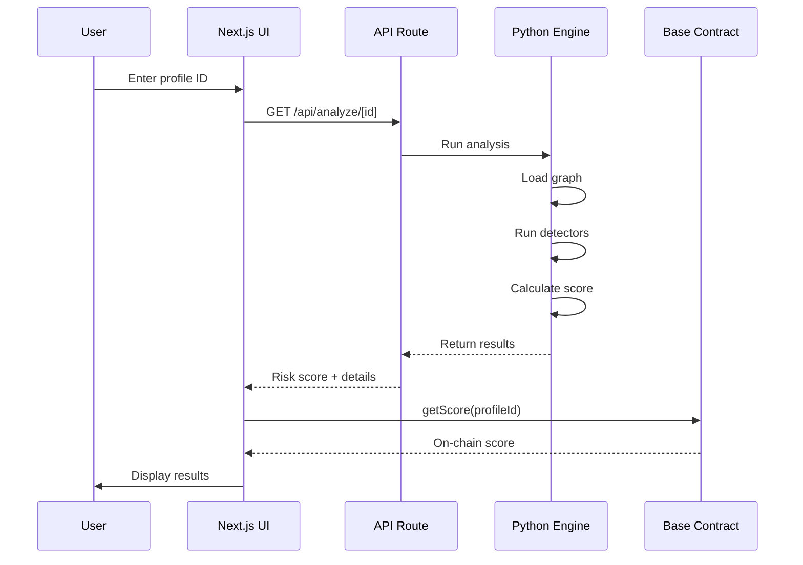

# Trust Ring Detector — Architecture

> **Tech Stack**: Python (analysis) + Solidity (Base contract) + Next.js (demo UI)

---

## 1. System Overview



---

## 2. Component Breakdown

### 2.1 Data Layer

| Component | Source | Format | Size |
|-----------|--------|--------|------|
| `vouches.json` | ethos-research | JSON array | 53,400 records |
| `markets.json` | ethos-research | JSON dict | 219 markets |
| Ethos API | Live | REST | On-demand |

**Vouch Record Structure:**
```python
{
    "authorProfileId": 31476,      # Who vouched
    "subjectProfileId": 26785,     # Who received vouch
    "balance": "1000000000000000", # Stake in wei
    "staked": true,
    "archived": false,
    "activityCheckpoints": {...},  # Timestamps
    "authorUser": {
        "score": 1404,
        "userkeys": ["service:x.com:..."]
    }
}
```

---

### 2.2 Analysis Engine (Python)

#### Directory Structure
```
src/
├── __init__.py
├── loader.py           # Load and parse vouch data
├── graph.py            # Build networkx graph
├── detectors/
│   ├── __init__.py
│   ├── rings.py        # Circular vouch detection
│   ├── clusters.py     # Isolated community detection
│   ├── bursts.py       # Temporal anomaly detection
│   ├── stakes.py       # Low-stake pattern detection
│   └── reciprocity.py  # Vouch balance analysis
├── scorer.py           # Composite risk scoring
└── exporter.py         # Output to JSON / contract
```

#### Graph Structure



**Graph Properties:**
- **Nodes**: Ethos profile IDs
- **Edges**: Directed (voucher → subject)
- **Edge Weight**: Stake amount in ETH
- **Node Attributes**: score, username, userkeys

---

### 2.3 Detection Algorithms

#### Ring Detection (Cycle Finding)

```python
# Pseudocode
def find_rings(graph, max_length=5):
    rings = []
    for node in graph.nodes():
        # DFS to find cycles back to starting node
        cycles = nx.simple_cycles(graph)
        for cycle in cycles:
            if 3 <= len(cycle) <= max_length:
                rings.append(cycle)
    return rings
```

**Complexity**: O(V + E) for each starting node

---

#### Cluster Detection (Community)

```python
# Using Louvain algorithm
from networkx.algorithms.community import louvain_communities

def find_clusters(graph):
    communities = louvain_communities(graph.to_undirected())

    for community in communities:
        internal = count_internal_edges(community)
        external = count_external_edges(community)
        insularity = internal / (internal + external)

        if insularity > 0.8:
            flag_as_suspicious(community)
```

---

#### Burst Detection (Temporal)



```python
def detect_bursts(profile_id, vouches, window_days=7):
    # Group vouches by time window
    windows = group_by_window(vouches, window_days)

    # Calculate statistics
    mean = np.mean([len(w) for w in windows])
    std = np.std([len(w) for w in windows])

    # Flag windows > 3 std deviations
    for window in windows:
        if len(window) > mean + 3 * std:
            return True, len(window)

    return False, 0
```

---

### 2.4 Risk Scorer



**Score Normalization:**
```python
def normalize_score(raw_value, min_val, max_val):
    """Normalize any metric to 0-100 scale"""
    return min(100, max(0, (raw_value - min_val) / (max_val - min_val) * 100))
```

---

### 2.5 Base Smart Contract

#### Contract: `RiskRegistry.sol`

```solidity
// SPDX-License-Identifier: MIT
pragma solidity ^0.8.19;

contract RiskRegistry {
    struct RiskScore {
        uint8 score;          // 0-100
        uint32 timestamp;     // When calculated
        uint8 ringFlag;       // 1 if in ring
        uint8 clusterFlag;    // 1 if isolated cluster
        uint8 burstFlag;      // 1 if burst detected
    }

    mapping(uint256 => RiskScore) public scores;  // profileId => score
    address public owner;

    event ScoreUpdated(uint256 indexed profileId, uint8 score, uint32 timestamp);

    modifier onlyOwner() {
        require(msg.sender == owner, "Not owner");
        _;
    }

    constructor() {
        owner = msg.sender;
    }

    function setScore(
        uint256 profileId,
        uint8 score,
        uint8 ringFlag,
        uint8 clusterFlag,
        uint8 burstFlag
    ) external onlyOwner {
        scores[profileId] = RiskScore({
            score: score,
            timestamp: uint32(block.timestamp),
            ringFlag: ringFlag,
            clusterFlag: clusterFlag,
            burstFlag: burstFlag
        });
        emit ScoreUpdated(profileId, score, uint32(block.timestamp));
    }

    function batchSetScores(
        uint256[] calldata profileIds,
        uint8[] calldata scoreValues,
        uint8[] calldata ringFlags,
        uint8[] calldata clusterFlags,
        uint8[] calldata burstFlags
    ) external onlyOwner {
        require(profileIds.length == scoreValues.length, "Length mismatch");
        for (uint i = 0; i < profileIds.length; i++) {
            scores[profileIds[i]] = RiskScore({
                score: scoreValues[i],
                timestamp: uint32(block.timestamp),
                ringFlag: ringFlags[i],
                clusterFlag: clusterFlags[i],
                burstFlag: burstFlags[i]
            });
            emit ScoreUpdated(profileIds[i], scoreValues[i], uint32(block.timestamp));
        }
    }

    function getScore(uint256 profileId) external view returns (
        uint8 score,
        uint32 timestamp,
        uint8 ringFlag,
        uint8 clusterFlag,
        uint8 burstFlag
    ) {
        RiskScore memory s = scores[profileId];
        return (s.score, s.timestamp, s.ringFlag, s.clusterFlag, s.burstFlag);
    }
}
```

#### Deployment Config

```javascript
// hardhat.config.js
module.exports = {
  solidity: "0.8.19",
  networks: {
    baseSepolia: {
      url: "https://sepolia.base.org",
      chainId: 84532,
      accounts: [process.env.PRIVATE_KEY]
    },
    base: {
      url: "https://mainnet.base.org",
      chainId: 8453,
      accounts: [process.env.PRIVATE_KEY]
    }
  }
};
```

---

### 2.6 Demo UI (Next.js)

#### Pages

| Route | Purpose |
|-------|---------|
| `/` | Landing + profile input |
| `/profile/[id]` | Risk analysis for specific profile |
| `/explore` | Network visualization |

#### Components

```
app/
├── page.tsx              # Landing with search
├── profile/
│   └── [id]/
│       └── page.tsx      # Profile risk display
├── explore/
│   └── page.tsx          # Network visualization
└── components/
    ├── SearchInput.tsx   # Twitter handle / profile ID input
    ├── RiskGauge.tsx     # Visual risk score display
    ├── NetworkGraph.tsx  # D3/vis.js vouch network
    ├── FlagBadges.tsx    # Ring/Cluster/Burst indicators
    └── OnChainScore.tsx  # Query Base contract
```

#### Network Visualization



**Libraries:**
- `vis-network` or `react-force-graph` for graph rendering
- `wagmi` + `viem` for Base contract queries
- `@coinbase/onchainkit` for wallet connection

---

## 3. Data Flow



---

## 4. Tech Stack Summary

| Layer | Technology | Why |
|-------|------------|-----|
| **Analysis** | Python 3.11 | networkx, numpy, existing ethos-py SDK |
| **Graph** | networkx | Battle-tested graph algorithms |
| **Contract** | Solidity 0.8.19 | Simple, gas-efficient storage |
| **Chain** | Base Sepolia → Mainnet | Hackathon requirement, cheap gas |
| **Frontend** | Next.js 14 | Fast, OnchainKit support |
| **Visualization** | vis-network | Interactive graph rendering |
| **Wallet** | OnchainKit | Base-native wallet connection |

---

## 5. File Structure (Complete)

```
ethos-vibeathon/
├── README.md
├── docs/
│   ├── PRD.md
│   ├── ARCHITECTURE.md
│   └── plans/
│       └── 2025-01-20-trust-ring-detector.md
│
├── analysis/                    # Python analysis engine
│   ├── pyproject.toml
│   ├── requirements.txt
│   ├── src/
│   │   ├── __init__.py
│   │   ├── loader.py
│   │   ├── graph.py
│   │   ├── detectors/
│   │   │   ├── __init__.py
│   │   │   ├── rings.py
│   │   │   ├── clusters.py
│   │   │   ├── bursts.py
│   │   │   ├── stakes.py
│   │   │   └── reciprocity.py
│   │   ├── scorer.py
│   │   └── exporter.py
│   ├── tests/
│   │   └── test_detectors.py
│   └── outputs/
│       └── risk_scores.json
│
├── contracts/                   # Solidity contracts
│   ├── hardhat.config.js
│   ├── package.json
│   ├── contracts/
│   │   └── RiskRegistry.sol
│   ├── scripts/
│   │   └── deploy.js
│   └── test/
│       └── RiskRegistry.test.js
│
└── web/                         # Next.js demo UI
    ├── package.json
    ├── next.config.js
    ├── app/
    │   ├── layout.tsx
    │   ├── page.tsx
    │   ├── profile/[id]/page.tsx
    │   └── explore/page.tsx
    ├── components/
    │   ├── SearchInput.tsx
    │   ├── RiskGauge.tsx
    │   ├── NetworkGraph.tsx
    │   └── OnChainScore.tsx
    └── lib/
        ├── contract.ts
        └── analysis.ts
```

---

## 6. External Dependencies

### Python (analysis/)
```
networkx>=3.0
numpy>=1.24
pandas>=2.0
ethos-py>=0.2.3
python-dotenv>=1.0
```

### Node (contracts/)
```
hardhat
@nomicfoundation/hardhat-toolbox
dotenv
```

### Node (web/)
```
next
react
wagmi
viem
@coinbase/onchainkit
vis-network
```

---

*Document created: 2025-01-20*
